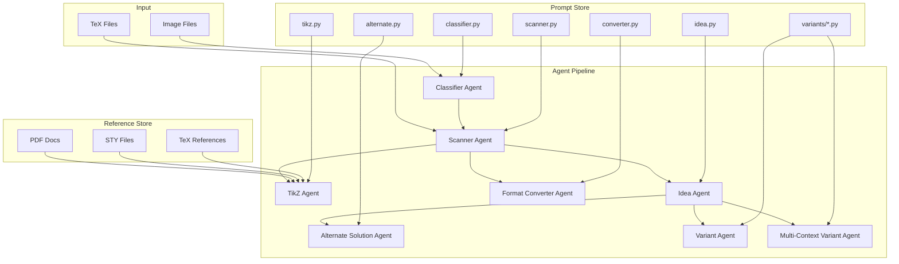

# Design Document

## Overview

VBAgent is a multi-agent physics question processing system built on the `openai-agents` SDK (official OpenAI Agents framework). The system uses `Agent`, `Runner`, and `function_tool` from the SDK to implement a pipeline architecture where specialized agents handle distinct tasks: classification, scanning, diagram generation, idea extraction, solution alternatives, variant creation, and format conversion. Each agent has dedicated prompts and can leverage a reference file search system (via `function_tool`) for context-aware processing.

Key SDK patterns used:
- `Agent(name, instructions, tools, output_type)` - Define agents with prompts and optional tools
- `Runner.run_sync(agent, input)` - Synchronous execution
- `Runner.run(agent, input)` - Async execution  
- `@function_tool` - Define tools agents can call
- `output_type` - Structured output using Pydantic models

## Architecture



## Components and Interfaces

### 1. Core Agent Utilities (using openai-agents SDK)

```python
# vbagent/agents/base.py
from agents import Agent, Runner, function_tool

def encode_image(image_path: str) -> tuple[str, str]:
    """Encode an image file to base64 for vision models."""
    pass

def create_image_message(image_path: str, text: str) -> list[dict]:
    """Create a message with image and text for the agent."""
    pass

async def run_agent(agent: Agent, input_text: str) -> str:
    """Run an agent asynchronously."""
    result = await Runner.run(agent, input=input_text)
    return result.final_output

def run_agent_sync(agent: Agent, input_text: str) -> str:
    """Run an agent synchronously."""
    result = Runner.run_sync(agent, input=input_text)
    return result.final_output
```

### 2. Classifier Agent

```python
# vbagent/agents/classifier.py
from agents import Agent, Runner
from vbagent.prompts.classifier import SYSTEM_PROMPT
from vbagent.models.classification import ClassificationResult

# Create the classifier agent
classifier_agent = Agent(
    name="Classifier",
    instructions=SYSTEM_PROMPT,
    output_type=ClassificationResult,  # Structured output
)

def classify(image_path: str) -> ClassificationResult:
    """Analyze image and return structured metadata."""
    message = create_image_message(image_path, "Classify this physics question.")
    result = Runner.run_sync(classifier_agent, input=message)
    return result.final_output

@dataclass
class ClassificationResult:
    question_type: str  # mcq_sc, mcq_mc, subjective, etc.
    difficulty: str     # easy, medium, hard
    topic: str
    subtopic: str
    has_diagram: bool
    diagram_type: str | None
    num_options: int | None
    confidence: float
```

### 3. Scanner Agent

```python
# vbagent/agents/scanner.py
from agents import Agent, Runner
from vbagent.prompts.scanner import get_scanner_prompt

def create_scanner_agent(question_type: str) -> Agent:
    """Create a scanner agent with type-specific prompt."""
    prompt = get_scanner_prompt(question_type)
    return Agent(
        name=f"Scanner-{question_type}",
        instructions=prompt,
    )

def scan(image_path: str, classification: ClassificationResult) -> ScanResult:
    """Extract LaTeX using prompt for classified type."""
    agent = create_scanner_agent(classification.question_type)
    message = create_image_message(image_path, "Extract LaTeX from this physics question.")
    result = Runner.run_sync(agent, input=message)
    return ScanResult(
        latex=result.final_output,
        has_diagram=classification.has_diagram,
        raw_diagram_description=None,
    )

@dataclass
class ScanResult:
    latex: str
    has_diagram: bool
    raw_diagram_description: str | None
```

### 4. TikZ Agent

```python
# vbagent/agents/tikz.py
from agents import Agent, Runner, function_tool
from vbagent.prompts.tikz import SYSTEM_PROMPT
from vbagent.references.store import ReferenceStore

@function_tool
def search_tikz_reference(query: str) -> str:
    """Search TikZ/PGF reference files for syntax examples."""
    store = ReferenceStore.get_instance()
    results = store.search(query, file_types=["sty", "tex", "pdf"])
    return "\n".join(r.content for r in results[:3])

tikz_agent = Agent(
    name="TikZ",
    instructions=SYSTEM_PROMPT,
    tools=[search_tikz_reference],
)

def generate_tikz(description: str, image_path: str = None) -> str:
    """Generate TikZ code, searching references for syntax."""
    if image_path:
        message = create_image_message(image_path, f"Generate TikZ code for this diagram. {description}")
    else:
        message = f"Generate TikZ code for: {description}"
    result = Runner.run_sync(tikz_agent, input=message)
    return result.final_output
```

### 5. Idea Agent

```python
# vbagent/agents/idea.py
from agents import Agent, Runner
from vbagent.prompts.idea import SYSTEM_PROMPT
from vbagent.models.idea import IdeaResult

idea_agent = Agent(
    name="Idea",
    instructions=SYSTEM_PROMPT,
    output_type=IdeaResult,  # Structured output
)

def extract_ideas(problem_latex: str, solution_latex: str) -> IdeaResult:
    """Extract core concepts and techniques."""
    message = f"Problem:\n{problem_latex}\n\nSolution:\n{solution_latex}"
    result = Runner.run_sync(idea_agent, input=message)
    return result.final_output

@dataclass
class IdeaResult:
    concepts: list[str]
    formulas: list[str]
    techniques: list[str]
    difficulty_factors: list[str]
```

### 6. Alternate Solution Agent

```python
# vbagent/agents/alternate.py
from agents import Agent, Runner
from vbagent.prompts.alternate import SYSTEM_PROMPT

alternate_agent = Agent(
    name="AlternateSolution",
    instructions=SYSTEM_PROMPT,
)

def generate_alternate(problem: str, solution: str, ideas: IdeaResult) -> str:
    """Generate alternate solution approach."""
    message = f"""Problem:\n{problem}\n
Original Solution:\n{solution}\n
Key Concepts: {', '.join(ideas.concepts)}\n
Techniques Used: {', '.join(ideas.techniques)}"""
    result = Runner.run_sync(alternate_agent, input=message)
    return result.final_output
```

### 7. Variant Agents

```python
# vbagent/agents/variant.py
from agents import Agent, Runner
from vbagent.prompts.variants import (
    numerical, context, conceptual, conceptual_calculus
)

VARIANT_PROMPTS = {
    "numerical": numerical.SYSTEM_PROMPT,
    "context": context.SYSTEM_PROMPT,
    "conceptual": conceptual.SYSTEM_PROMPT,
    "calculus": conceptual_calculus.SYSTEM_PROMPT,
}

def create_variant_agent(variant_type: str) -> Agent:
    """Create a variant agent with type-specific prompt."""
    return Agent(
        name=f"Variant-{variant_type}",
        instructions=VARIANT_PROMPTS[variant_type],
    )

def generate_variant(source_latex: str, variant_type: str, ideas: IdeaResult = None) -> str:
    """Generate variant of the source problem."""
    agent = create_variant_agent(variant_type)
    message = f"Source Problem:\n{source_latex}"
    if ideas:
        message += f"\n\nKey Concepts: {', '.join(ideas.concepts)}"
    result = Runner.run_sync(agent, input=message)
    return result.final_output
```

### 8. Multi-Context Variant Agent

```python
# vbagent/agents/multi_variant.py
from agents import Agent, Runner
from vbagent.prompts.variants.multi_context import SYSTEM_PROMPT

multi_context_agent = Agent(
    name="MultiContextVariant",
    instructions=SYSTEM_PROMPT,
)

def generate_multi_context_variant(source_problems: list[str], target_style: str = None) -> str:
    """Combine elements from multiple problems."""
    problems_text = "\n\n---\n\n".join(
        f"Problem {i+1}:\n{p}" for i, p in enumerate(source_problems)
    )
    message = f"Source Problems:\n{problems_text}"
    if target_style:
        message += f"\n\nTarget Style: {target_style}"
    result = Runner.run_sync(multi_context_agent, input=message)
    return result.final_output
```

### 9. Format Converter Agent

```python
# vbagent/agents/converter.py
from agents import Agent, Runner
from vbagent.prompts.converter import SYSTEM_PROMPT

converter_agent = Agent(
    name="FormatConverter",
    instructions=SYSTEM_PROMPT,
)

def convert_format(source_latex: str, source_format: str, target_format: str) -> str:
    """Convert question to target format."""
    message = f"""Source Format: {source_format}
Target Format: {target_format}

Source Problem:
{source_latex}"""
    result = Runner.run_sync(converter_agent, input=message)
    return result.final_output
```

### 10. Reference Store

```python
# vbagent/references/store.py
class ReferenceStore:
    """Manages and searches reference files."""
    
    def __init__(self, directories: list[str]):
        self.directories = directories
        self.index = {}
    
    def index_files(self) -> None:
        """Index PDF, TeX, STY files for search."""
        pass
    
    def search(self, query: str, file_types: list[str] = None) -> list[SearchResult]:
        """Search references for relevant content."""
        pass

@dataclass
class SearchResult:
    file_path: str
    content: str
    relevance_score: float
```

### 11. CLI Orchestration

The CLI serves as the orchestration layer, coordinating all agents through a unified interface. Each command is in its own file under `vbagent/cli/`.

```python
# vbagent/cli/main.py
import click
from vbagent.cli import classify, scan, tikz, idea, alternate, variant, convert, process

@click.group()
@click.version_option()
def main():
    """VBAgent - Physics question processing pipeline."""
    pass

main.add_command(classify.classify)
main.add_command(scan.scan)
main.add_command(tikz.tikz)
main.add_command(idea.idea)
main.add_command(alternate.alternate)
main.add_command(variant.variant)
main.add_command(convert.convert)
main.add_command(process.process)
```

#### CLI Commands Detail

```python
# vbagent/cli/classify.py
@click.command()
@click.option('-i', '--image', required=True, type=click.Path(exists=True), help='Image file path')
@click.option('-o', '--output', type=click.Path(), help='Output JSON file')
@click.option('--json', 'as_json', is_flag=True, help='Output as JSON')
def classify(image, output, as_json):
    """Stage 1: Classify physics question image.
    
    Extracts metadata: question_type, difficulty, topic, has_diagram, etc.
    
    Example: vbagent classify -i images/q1.png -o classification.json
    """
    pass

# vbagent/cli/scan.py
@click.command()
@click.option('-i', '--image', type=click.Path(exists=True), help='Image file path')
@click.option('-t', '--tex', type=click.Path(exists=True), help='TeX file path')
@click.option('--type', 'question_type', type=click.Choice(['mcq_sc', 'mcq_mc', 'subjective', 'assertion_reason', 'passage', 'match']), help='Override question type')
@click.option('-o', '--output', type=click.Path(), help='Output TeX file')
def scan(image, tex, question_type, output):
    """Stage 2: Extract LaTeX from image.
    
    Runs classification first (unless --type provided), then extracts LaTeX.
    
    Example: vbagent scan -i images/q1.png -o output.tex
    Example: vbagent scan -i images/q1.png --type mcq_sc
    """
    pass

# vbagent/cli/tikz.py
@click.command()
@click.option('-i', '--image', type=click.Path(exists=True), help='Diagram image')
@click.option('-d', '--description', help='Text description of diagram')
@click.option('--ref', 'ref_dirs', multiple=True, type=click.Path(exists=True), help='Reference directories')
@click.option('-o', '--output', type=click.Path(), help='Output TeX file')
def tikz(image, description, ref_dirs, output):
    """Generate TikZ code for diagrams.
    
    Can use image or text description. Searches reference files for syntax.
    
    Example: vbagent tikz -i diagram.png --ref refs/tikz/ -o diagram.tex
    """
    pass

# vbagent/cli/idea.py
@click.command()
@click.option('-t', '--tex', required=True, type=click.Path(exists=True), help='TeX file with problem+solution')
@click.option('-o', '--output', type=click.Path(), help='Output JSON file')
def idea(tex, output):
    """Extract physics concepts and problem-solving ideas.
    
    Analyzes problem and solution to identify concepts, formulas, techniques.
    
    Example: vbagent idea -t problem.tex -o ideas.json
    """
    pass

# vbagent/cli/alternate.py
@click.command()
@click.option('-t', '--tex', required=True, type=click.Path(exists=True), help='TeX file with problem+solution')
@click.option('--ideas', type=click.Path(exists=True), help='Ideas JSON from idea command')
@click.option('-n', '--count', default=1, help='Number of alternates')
@click.option('-o', '--output', type=click.Path(), help='Output TeX file')
def alternate(tex, ideas, count, output):
    """Generate alternative solution methods.
    
    Example: vbagent alternate -t problem.tex --ideas ideas.json -n 2 -o alt.tex
    """
    pass

# vbagent/cli/variant.py
@click.command()
@click.option('-i', '--image', type=click.Path(exists=True), help='Image file path')
@click.option('-t', '--tex', type=click.Path(exists=True), help='TeX file path')
@click.option('--type', 'variant_type', required=True, type=click.Choice(['numerical', 'context', 'conceptual', 'calculus', 'multi']), help='Variant type')
@click.option('-r', '--range', 'item_range', nargs=2, type=int, help='Range of items to process (start end)')
@click.option('-n', '--count', default=1, help='Number of variants')
@click.option('--context', 'context_files', multiple=True, type=click.Path(exists=True), help='Additional context files for multi variant')
@click.option('-o', '--output', type=click.Path(), help='Output TeX file')
def variant(image, tex, variant_type, item_range, count, context_files, output):
    """Generate problem variants.
    
    Types:
    - numerical: Change only numbers
    - context: Change scenario, keep numbers
    - conceptual: Change physics concept
    - calculus: Add calculus elements
    - multi: Combine multiple problems
    
    Example: vbagent variant -t problem.tex --type numerical -n 3 -o variants.tex
    Example: vbagent variant --type multi --context p1.tex --context p2.tex -o combined.tex
    """
    pass

# vbagent/cli/convert.py
@click.command()
@click.option('-i', '--image', type=click.Path(exists=True), help='Image file path')
@click.option('-t', '--tex', type=click.Path(exists=True), help='TeX file path')
@click.option('--from', 'source_format', required=True, type=click.Choice(['mcq_sc', 'mcq_mc', 'subjective', 'integer']), help='Source format')
@click.option('--to', 'target_format', required=True, type=click.Choice(['mcq_sc', 'mcq_mc', 'subjective', 'integer']), help='Target format')
@click.option('-o', '--output', type=click.Path(), help='Output TeX file')
def convert(image, tex, source_format, target_format, output):
    """Convert question between formats.
    
    Example: vbagent convert -t subjective.tex --from subjective --to mcq_sc -o mcq.tex
    Example: vbagent convert -t mcq.tex --from mcq_sc --to integer -o integer.tex
    """
    pass

# vbagent/cli/process.py
@click.command()
@click.option('-i', '--image', type=click.Path(exists=True), help='Image file path')
@click.option('-t', '--tex', type=click.Path(exists=True), help='TeX file path')
@click.option('-r', '--range', 'item_range', nargs=2, type=int, help='Range of items')
@click.option('--variants', 'variant_types', multiple=True, type=click.Choice(['numerical', 'context', 'conceptual', 'calculus']), help='Variant types to generate')
@click.option('--alternate/--no-alternate', default=False, help='Generate alternate solutions')
@click.option('--ref', 'ref_dirs', multiple=True, type=click.Path(exists=True), help='Reference directories')
@click.option('-o', '--output', type=click.Path(), help='Output directory')
def process(image, tex, item_range, variant_types, alternate, ref_dirs, output):
    """Full pipeline: Classify → Scan → TikZ → Ideas → Variants.
    
    Orchestrates all agents for complete processing.
    
    Example: vbagent process -i images/q1.png --variants numerical context -o output/
    Example: vbagent process -t problems.tex -r 1 5 --alternate -o output/
    """
    pass
```

#### CLI Usage Examples

```bash
# Basic classification
vbagent classify -i images/problem_1.png

# Scan with auto-classification
vbagent scan -i images/problem_1.png -o problem_1.tex

# Scan with explicit type
vbagent scan -i images/problem_1.png --type mcq_sc -o problem_1.tex

# Generate TikZ with references
vbagent tikz -i diagram.png --ref refs/tikz/ --ref refs/pgf/ -o diagram.tex

# Extract ideas
vbagent idea -t problem.tex -o ideas.json

# Generate alternate solutions
vbagent alternate -t problem.tex --ideas ideas.json -n 2 -o alternates.tex

# Generate numerical variants
vbagent variant -t problem.tex --type numerical -n 3 -o variants.tex

# Generate multi-context variant
vbagent variant --type multi --context p1.tex --context p2.tex --context p3.tex -o hybrid.tex

# Convert MCQ to subjective
vbagent convert -t mcq.tex --from mcq_sc --to subjective -o subjective.tex

# Full pipeline with range
vbagent process -i images/problems.png -r 1 5 --variants numerical context --alternate -o output/

# Process TeX file with all variants
vbagent process -t problems.tex --variants numerical context conceptual calculus -o output/
```

## Data Models

### Classification Schema

```python
@dataclass
class ClassificationResult:
    question_type: Literal["mcq_sc", "mcq_mc", "subjective", "assertion_reason", "passage", "match"]
    difficulty: Literal["easy", "medium", "hard"]
    topic: str
    subtopic: str
    has_diagram: bool
    diagram_type: str | None  # graph, circuit, free_body, geometry, none
    num_options: int | None
    estimated_marks: int
    key_concepts: list[str]
    requires_calculus: bool
    confidence: float
```

### Pipeline Result Schema

```python
@dataclass
class PipelineResult:
    source_path: str
    classification: ClassificationResult
    latex: str
    tikz_code: str | None
    ideas: IdeaResult | None
    alternate_solutions: list[str]
    variants: dict[str, str]  # variant_type -> latex
```

## Prompt Organization

```
vbagent/
├── prompts/
│   ├── __init__.py
│   ├── classifier.py      # SYSTEM_PROMPT, USER_TEMPLATE
│   ├── scanner/
│   │   ├── __init__.py
│   │   ├── mcq_sc.py
│   │   ├── mcq_mc.py
│   │   ├── subjective.py
│   │   ├── assertion_reason.py
│   │   ├── passage.py
│   │   └── match.py
│   ├── tikz.py
│   ├── idea.py
│   ├── alternate.py
│   ├── variants/
│   │   ├── __init__.py
│   │   ├── numerical.py
│   │   ├── context.py
│   │   ├── conceptual.py
│   │   ├── conceptual_calculus.py
│   │   └── multi_context.py
│   └── converter.py
```


## Correctness Properties

*A property is a characteristic or behavior that should hold true across all valid executions of a system-essentially, a formal statement about what the system should do. Properties serve as the bridge between human-readable specifications and machine-verifiable correctness guarantees.*

### Property 1: Classification Output Validity
*For any* valid image input, the Classifier Agent SHALL return a JSON object containing question_type from the set {mcq_sc, mcq_mc, subjective, assertion_reason, passage, match} and difficulty from {easy, medium, hard}.
**Validates: Requirements 1.1, 1.2, 1.3**

### Property 2: Scanner Prompt Selection
*For any* classification result with a question_type, the Scanner Agent SHALL load and use the prompt file corresponding to that question_type.
**Validates: Requirements 2.1**

### Property 3: LaTeX Output Structure
*For any* successful scan operation, the output LaTeX SHALL start with `\item` and end with `\end{solution}`.
**Validates: Requirements 2.4**

### Property 4: TikZ Generation Trigger
*For any* classification where has_diagram is true, the TikZ Agent SHALL be invoked and produce non-empty TikZ code containing a tikzpicture environment.
**Validates: Requirements 3.1, 3.3, 3.4**

### Property 5: Idea Extraction Completeness
*For any* valid problem and solution LaTeX input, the Idea Agent SHALL return an IdeaResult with non-empty concepts and techniques lists.
**Validates: Requirements 4.1, 4.2**

### Property 6: Alternate Solution Answer Preservation
*For any* alternate solution generated, the final numerical answer SHALL match the original solution's answer.
**Validates: Requirements 5.3**

### Property 7: Numerical Variant Number Modification
*For any* numerical variant generated from a source problem, at least one numerical value SHALL differ from the source while all non-numerical context words remain unchanged.
**Validates: Requirements 6.1**

### Property 8: Context Variant Number Preservation
*For any* context variant generated from a source problem, all numerical values SHALL remain identical to the source while the scenario description changes.
**Validates: Requirements 6.2**

### Property 9: Variant Solution Completeness
*For any* variant generated (numerical, context, conceptual, or calculus), the output SHALL contain a complete solution environment with recalculated steps.
**Validates: Requirements 6.5, 6.6**

### Property 10: Multi-Context Output Coherence
*For any* multi-context variant generated from multiple source problems, the output SHALL be a single coherent problem with one solution, not a concatenation of fragments.
**Validates: Requirements 7.3, 7.4**

### Property 11: Format Conversion Structure
*For any* format conversion, the output structure SHALL match the target format: MCQ outputs contain tasks environment, subjective outputs do not contain tasks environment, integer type outputs request numerical answer.
**Validates: Requirements 8.1, 8.2, 8.3, 8.5**

### Property 12: Reference Search File Type Support
*For any* reference search query, the system SHALL be able to search and return results from PDF, TeX, and STY files in configured directories.
**Validates: Requirements 9.2, 9.5**

### Property 13: CLI Range Filtering
*For any* command with -r/--range specified as (start, end), the system SHALL process only items with indices in [start, end] inclusive.
**Validates: Requirements 10.3**

### Property 14: CLI Output Persistence
*For any* command with -o/--output specified, the result SHALL be written to the specified file path.
**Validates: Requirements 10.8**

### Property 15: Prompt File Organization
*For any* agent, there SHALL exist a corresponding prompt file containing both SYSTEM_PROMPT and USER_TEMPLATE constants.
**Validates: Requirements 11.3**

## Error Handling

### Classification Errors
- Invalid image format: Return error with supported formats list
- Unreadable image: Return error with file path
- Low confidence classification: Return result with confidence < 0.5 flagged

### Scanning Errors
- Unknown question type: Fall back to mcq_sc prompt
- Incomplete extraction: Return partial result with missing sections flagged
- Invalid LaTeX output: Attempt repair or return raw with warning

### Agent Communication Errors
- OpenAI API timeout: Retry with exponential backoff (3 attempts)
- Rate limiting: Queue requests with delay
- Invalid response format: Parse error with raw response preserved

### Reference Search Errors
- Directory not found: Log warning, continue without references
- File read error: Skip file, continue search
- No results found: Proceed with agent's default knowledge

## Testing Strategy

### Unit Testing
- Test each agent's prompt loading
- Test classification result parsing
- Test LaTeX structure validation
- Test reference file indexing
- Test CLI argument parsing

### Property-Based Testing
Using `hypothesis` library for Python:

- **Property 1-3**: Generate random valid image paths, verify classification and scan output structure
- **Property 7-8**: Generate source LaTeX, create variants, verify number/context preservation
- **Property 11**: Generate problems in each format, convert, verify target structure
- **Property 13**: Generate random ranges, verify only items in range are processed
- **Property 14**: Generate random output paths, verify file creation

Each property-based test SHALL:
- Run minimum 100 iterations
- Be tagged with comment: `**Feature: physics-question-pipeline, Property {N}: {description}**`
- Use `hypothesis` strategies for input generation

### Integration Testing
- Full pipeline: image → classification → scan → variants
- Reference search integration with TikZ agent
- CLI end-to-end with all commands
